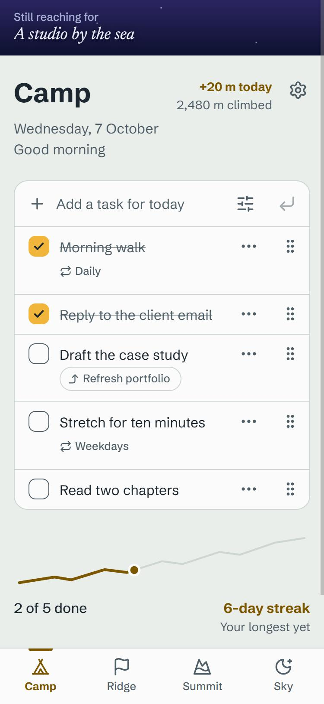
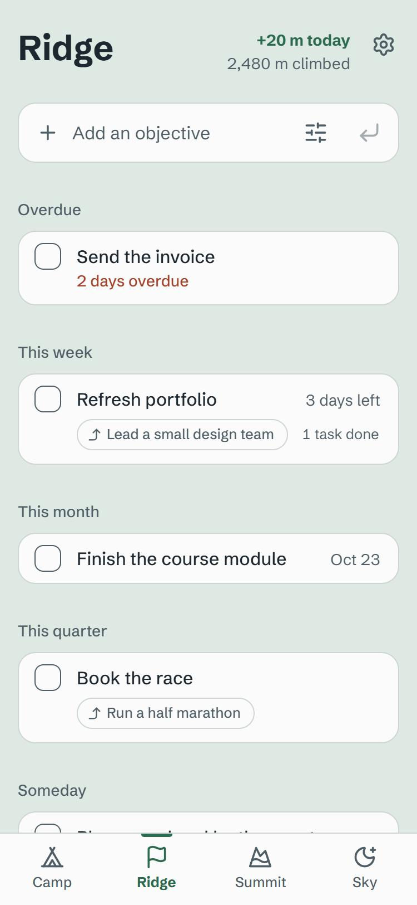
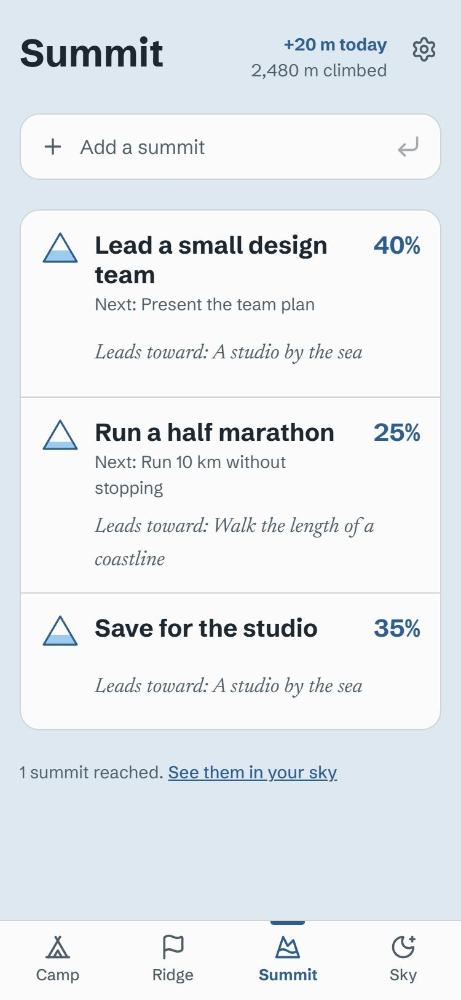
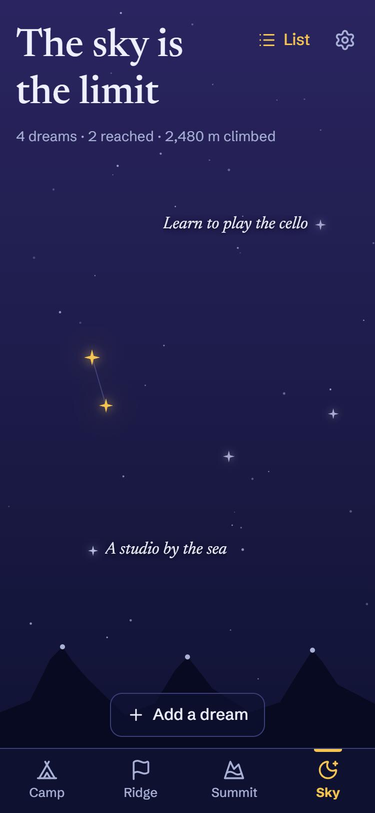
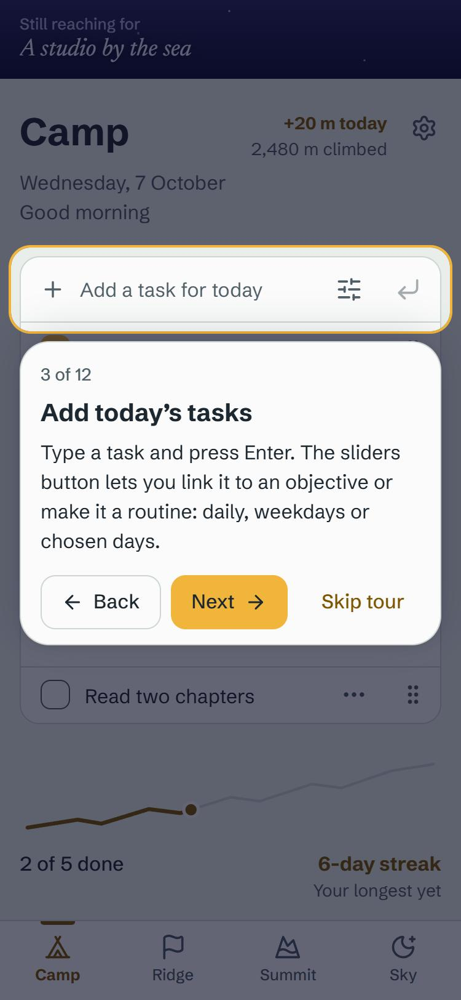

# Ascent

A personal planning app built on one idea: everything you do today is part of a climb.
Today's tasks at **Camp** carry you up to objectives on the **Ridge**, long-term goals on the
**Summit**, and the dreams in your **Sky**. _The sky is the limit._

Everything stays on your device (IndexedDB). It installs as an app and works offline.

- How to use the app: [docs/GUIDE.md](docs/GUIDE.md), also built into the app (the **?** button,
  or Settings → Guide), along with a one-minute guided tour.
- Product spec: [docs/PRODUCT.md](docs/PRODUCT.md) · Design system: [docs/DESIGN.md](docs/DESIGN.md)

| Camp                                                                           | Ridge                                                               | Summit                                                                   | Sky                                                                                | Guided tour                                                             |
| ------------------------------------------------------------------------------ | ------------------------------------------------------------------- | ------------------------------------------------------------------------ | ---------------------------------------------------------------------------------- | ----------------------------------------------------------------------- |
|  |  |  |  |  |

## Run it

Requires Node 22.12 or later (Node 24 recommended).

```bash
npm install
npm run dev
```

Then open http://localhost:5180.

| Command             | What it does                                               |
| ------------------- | ---------------------------------------------------------- |
| `npm run dev`       | Development server at http://localhost:5180                |
| `npm run build`     | Type-check and build to `dist/`, with the service worker   |
| `npm run preview`   | Serve the production build at http://localhost:5181        |
| `npm run test`      | Run all tests once (`npm run test:watch` to keep watching) |
| `npm run lint`      | ESLint, including accessibility rules                      |
| `npm run typecheck` | TypeScript in strict mode                                  |
| `npm run format`    | Prettier                                                   |
| `npm run icons`     | Regenerate the PNG icons from `public/logo.svg`            |

## Install it on a phone

Installing and offline use need the app served over HTTPS (or from `localhost`). To use it on
a phone, deploy `dist/` to any static host (Netlify, Vercel, GitHub Pages, Cloudflare Pages),
open the address on the phone, then choose **Install app** (Android) or **Share → Add to Home
Screen** (iPhone). On a computer, Chrome and Edge show an install button in the address bar,
and Settings → Install offers it too.

To move to a new device: Settings → **Back up data**, then on the new device choose **Restore a
backup** (on the welcome screen, or in Settings).

## Development helpers

These only exist in the dev server, never in a production build.

- **Sample data:** run `ascentSampleData()` in the browser console to replace the local database
  with a generic sample climb (dreams, summits, objectives, routines and a streak).
  `ascentSampleData({ tourDone: false })` also brings back the tour prompt.
- **Time travel:** open `http://localhost:5180/?now=2026-10-12T07:00` to make the app think it's
  that local date and time (for carry-over, streaks, reminders and the weekly review). It stays
  until you open `/?now=` with nothing after the equals sign.

## How it's built

Vite, React and TypeScript (strict). Plain CSS with design tokens and CSS Modules, no UI library.
Dexie (IndexedDB) for storage, date-fns for dates, motion for the few animations, lucide icons,
and vite-plugin-pwa for the installable, offline app. Tested with Vitest and React Testing
Library.

```
src/
  app/          App shell, routing, altitude navigation and transitions, PWA
  db/           Dexie schema, data access, backup and restore
  features/
    camp/       Today: tasks, routines, carry-over, streak, dream glimpse
    ridge/      Objectives
    summit/     Goals and milestones
    sky/        Dreams, starfield, constellation, horizon, reaching ceremony
    reminders/  Reminders, notifications, weekly review
    settings/   Preferences, reminders, backup, restore, reset
    onboarding/ First run
    guide/      The guide screen and the guided tour
  lib/          Pure logic with unit tests (dates, recurrence, streak, progress,
                altimeter, dream of the day, star positions, calendar export)
  components/   Shared UI: Button, Checkbox, Sheet, Field, LinkTag, ClimbLine, PeakGlyph…
  styles/       tokens.css, globals.css, fonts
```

Every colour pair is checked for WCAG AA contrast by a test that reads `src/styles/tokens.css`.
